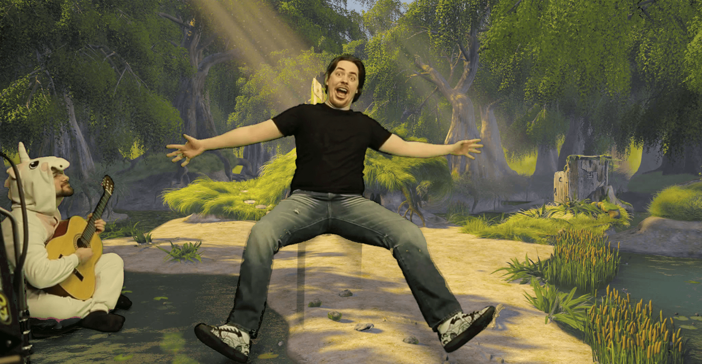
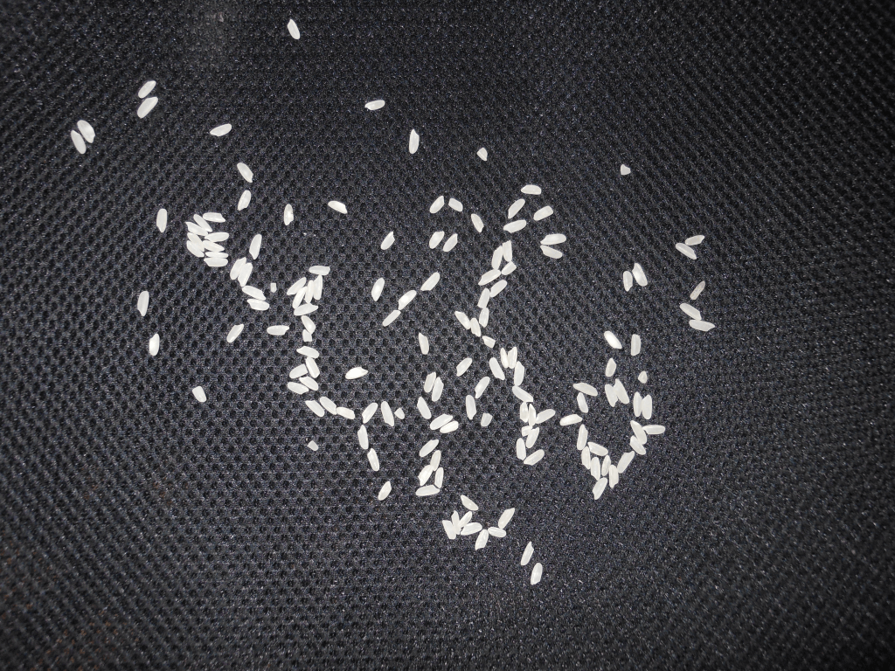

# Processamento Digital de Imagens
w/ [Kaminski](https://github.com/lucaskfreitas)

 ### Ementa:
Representação e aquisição de imagens digitais; 
Realce e melhoria de imagens; 
Morfologia matemática; 
Transformações; 
Segmentação; 
Aplicações.

 ### Aulas:
01 - Intro;
02 - Arroz e letras;
03 - Blur e limiarizacao adaptativa;
04 - Blur - Implementar;
05 - Normalização;
06 - Cores;
07 - Nitidez;
08 - Bloom;
09 - Resize;
10 - Morfologia;
11 - Gradientes;
12 - HDR;
13 - Otsu;
14 - Canny;
15 - Hough;
16 - Inpainting;
17 - Fourier;
18 - Filtragem no domínio da frequencia;
19 - Registro;
20 - Compressao;
21 - CNNs.

 ## Projetos
  - __T01:__ Rotulagem usando flood fill;
  - __T02:__ Filtro da média ou blur (“ingênuo”, separável e por imagens integrais);
  - __T03:__ Efeito bloom;
  - __T04:__ Desafio de estimar a quantidade de arroz em uma imagem;
  - __T05:__ Chroma key;
  - __Projeto Final:__ Super-resolução com Cartoons.
  
   
  
  # Projeto Final
Utilizar diferentes técnicas de Super-resolução em Cartoons.

__Original Image (4x Bilinear Interpolation)__  |  __Vectorization__
:-------------------------:|:-------------------------:
 |  
__[DCSCN](https://github.com/jiny2001/dcscn-super-resolution)__  |  __[waifu2x](https://github.com/nagadomi/waifu2x)__
 |  

    
  
  # T05: Chroma key

Input |  Output
:-------------------------:|:-------------------------:
 |  

     
  
  # T04: Desafio de estimar a quantidade de arroz em uma imagem
  
  Input (150 rices) |  Output Mask
:-------------------------:|:-------------------------:
 |  
  
      
   
  # T03: Efeito bloom
  
  Input  |  Output 
:-------------------------:|:-------------------------:
 |  
  
***
