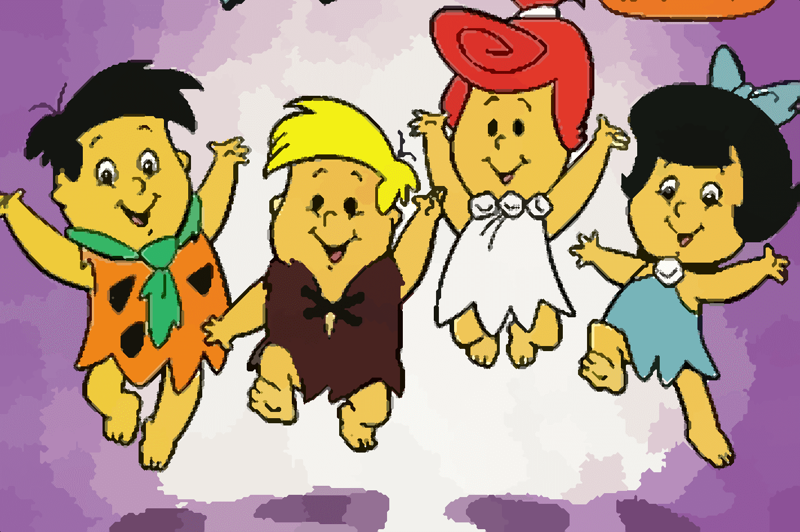

# Processamento Digital de Imagens
w/ [Kaminski](https://github.com/lucaskfreitas)

 - Representação e aquisição de imagens digitais; 
 - Realce e melhoria de imagens; 
 - Morfologia matemática; 
 - Transformações; 
 - Segmentação; 
 - Aplicações.

 ## Projetos
  - __T01:__ Rotulagem usando flood fill;
  - __T02:__ Filtro da média ou blur (“ingênuo”, separável e por imagens integrais);
  - __T03:__ Efeito bloom;
  - __T04:__ Desafio de estimar a quantidade de arroz em uma imagem;
  - __T05:__ Chroma key;
  - __Projeto Final:__ Super-resolução com Cartoons.
  
  ***
  # Projeto Final
Utilizar diferentes técnicas de Super-resolução em Cartoons.

__Original Image (4x Bilinear Interpolation)__  |  __Vectorization__
:-------------------------:|:-------------------------:
 |  
__[DCSCN](https://github.com/jiny2001/dcscn-super-resolution)__  |  __[waifu2x](https://github.com/nagadomi/waifu2x)__
 |  

  ***
  # T05: Chroma key

